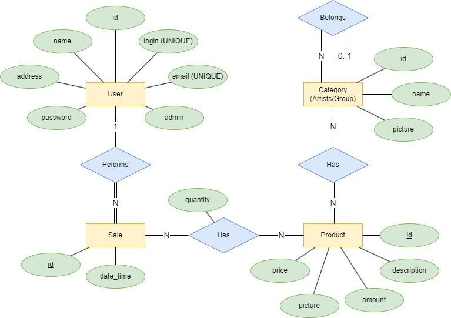
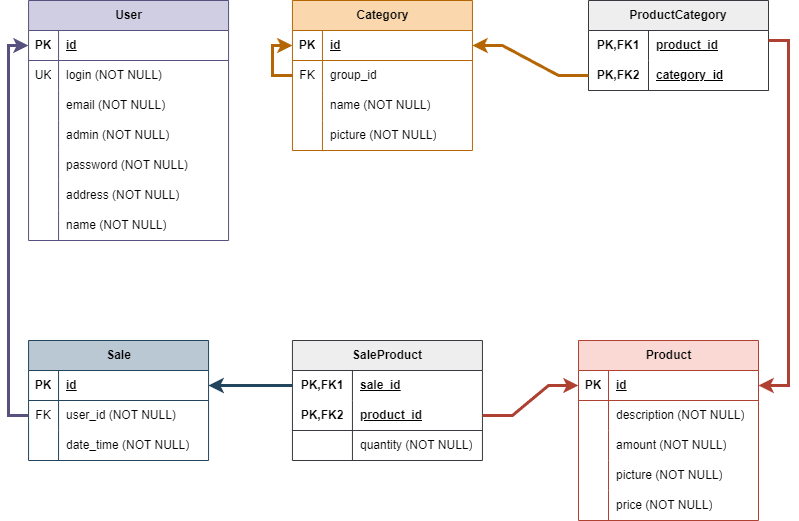

# Database Repository

Este repositório contém os arquivos necessários para instanciar o banco de dados e populá-lo com os dados disponibilizados. O banco foi desenvolvido utilizando o `PostgreSQL` e a linguagem `SQL` para criar um banco de dados relacional.

## Modelagem
A criação do banco de dados seguiu os modelos Entidade-Relacionamento e Relacional representados nas imagens abaixo:




## Como Instanciar o Banco de Dados

Para instanciar o banco, siga os passos abaixo:

1. Abra o `pgAdmin` e crie um novo banco de dados com o nome "stardust_db".

2. Execute os seguintes scripts na ordem indicada:

   - Script de criação do banco: `stardust_db_schema.sql` _(última atualização: 13/10/2023)_
   - Script de população do banco: `ainda-não-disponível.sql`

   O script de população ainda não está disponível, mas será adicionado posteriormente.

Com esses passos, o banco de dados estará pronto para ser utilizado.

## Usuário Admin

Para termos de teste, já existe um usuário admin, que será incluído junto com a criação do banco. A seguir as credenciais dele:

```sql
login: admin01
senha: 123456
```
